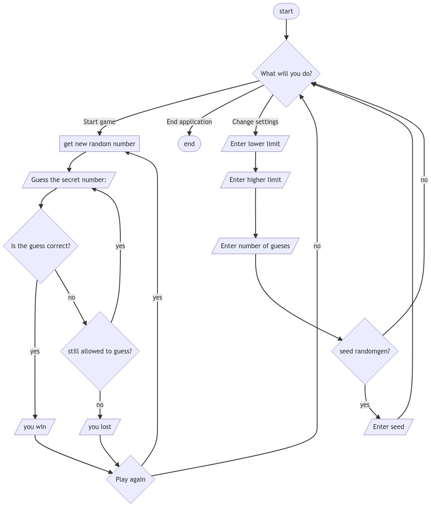

# CS4_Q1_Week4_HigherOrLower

## Task

Imagine that you’re trying to make a simple guessing game.
The application will generate a random number from 0 to 10 and the user is given a number of tries to guess it.
Every time the user guesses, it will respond by saying if the number is higher or lower.
The game ends if the user is able to guess the number or if the number of guesses runs out.
Include a settings option at the start which will allow the user to change the range and/or the number of guesses.

## Flowchart


## Sample Run

```
Welcome to Higher or Lower! What will you do?
- Start game
- Change settings
- End application

Start game

You have 3 guess(es) left. What is your guess? 5
Guess higher! You have 2 guess(es) left. What is your guess? 8

You got it!
Play again (y/n)? y

You have 3 guess(es) left. What is your guess? 5
Guess lower! You have 2 guess(es) left. What is your guess? 6
Guess lower! You have 1 guess(es) left. What is your guess? 7

You lost...
Play again (y/n)? n


Welcome to Higher or Lower! What will you do?
- Start game
- Change settings
- End application

Change settings

What is the lower limit of the random number? -5
What is the upper limit of the random number? 5
How many guesses are allowed? 5
Would you like to seed the random generator? (y/n) y
Enter an integer as a random seed: 5

Welcome to Higher or Lower! What will you do?
- Start game
- Change settings
- End application

Start game

You have 5 guess(es) left. What is your guess? 5
Guess lower! You have 4 guess(es) left. What is your guess? 2

You got it!
Play again (y/n)? n

Welcome to Higher or Lower! What will you do?
- Start game
- Change settings
- End application

End application

Thank you for playing!
```
